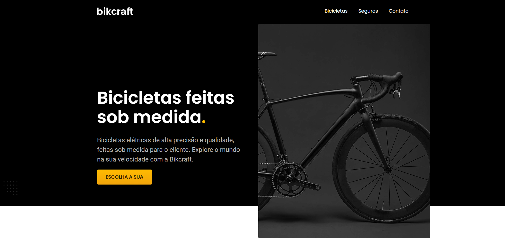

# 🚴‍♂️ Bikcraft — E-commerce Nichado

Este repositório contém o desenvolvimento do site **Bikcraft**, um e-commerce nichado focado na venda de bicicletas elétricas e oferta de planos de seguro personalizados. O projeto destaca-se pelo design responsivo, SEO, boas práticas de HTML, CSS e JavaScript, e uma estrutura pensada para diferentes dispositivos.

---

## 📁 Estrutura do Projeto

O projeto está organizado em páginas e pastas que garantem clareza, escalabilidade e performance:

### 🗂️ Páginas principais

| Arquivo             | Função                                                                 |
|---------------------|------------------------------------------------------------------------|
| `index.html`        | Página inicial com destaque para os produtos                          |
| `bicicletas.html`   | Catálogo geral de bicicletas elétricas                                |
| `seguros.html`      | Informações sobre os planos de seguro                                 |
| `orcamento.html`    | Formulário para solicitação de orçamento personalizado                |
| `contato.html`      | Página de contato com formulário integrado                            |
| `termos.html`       | Termos de uso e política de privacidade                               |

### 🚲 Páginas de produtos específicos

Dentro da pasta `bicicletas/`, há três páginas dedicadas a modelos exclusivos de bicicletas elétricas, cada uma com suas características:

| Arquivo                  | Modelo de bicicleta elétrica | Descrição                                  |
|--------------------------|------------------------------|---------------------------------------------|
| `magic.html`             | Magic                        | Design urbano com motor leve e ágil         |
| `nebula.html`            | Nebula                       | Modelo robusto para trilhas e terrenos irregulares |
| `nimbus.html`            | Nimbus                       | Bicicleta premium com autonomia estendida   |

### 📂 Pastas de suporte

| Pasta       | Conteúdo                                                                 |
|-------------|--------------------------------------------------------------------------|
| `css/`      | Arquivos de estilo para cada página (`style.css`, `seguros.css`, etc.) e o arquivo minificado `cleancss.min.css` gerado com [CleanCSS](https://www.cleancss.com/) para otimização |
| `js/`       | Scripts JavaScript para interações, validações e funcionalidades extras |
| `img/`      | Imagens do site, incluindo produtos, ícones, backgrounds e ilustrações  |

---

## 🎨 Design no Figma

Todo o design do projeto foi criado em um único arquivo `.fig`, contendo todas as telas e fluxos do site.

📁 **[Download do arquivo Figma (.fig)](https://drive.google.com/file/d/1mwskmgbdCl2t5eQgMPcaMTPcAT4TZrtF/view?usp=sharing)**  
*(Você pode abrir esse arquivo diretamente no Figma usando a opção “Importar”)*

---

## 🧼 Otimização de CSS

O CSS foi otimizado para produção utilizando a ferramenta [CleanCSS](https://www.cleancss.com/), que realiza:

- Minificação do código (remoção de espaços, quebras de linha e comentários)
- Compactação para melhorar o tempo de carregamento
- Organização das regras CSS para facilitar manutenção

---

## 🛠️ Tecnologias Utilizadas

- **HTML5**: Estrutura semântica
- **CSS3**: Layout responsivo e animações
- **JavaScript**: Validação de formulários e interações básicas

---

## 📸 Demonstração

Abaixo está uma prévia visual do projeto Bikcraft:

  
*A imagem mostra a página inicial do site com design responsivo e moderno.*

---

## 🌐 Deploy

O projeto está disponível online via GitHub Pages:  
👉 [Acesse o site Bikcraft](https://jhonnyaraujo.github.io/bikcraft)

---

## 📌 Status do Projeto

✅ Layout finalizado  
✅ Prototipagem no Figma  
🔄 Otimizações em andamento  
🚀 Deploy ativo via GitHub Pages

---

## 📚 Créditos e Referência de Aprendizado

Este projeto foi desenvolvido como parte da conclusão dos cursos da plataforma [Origamid](https://www.origamid.com/curso/):

- **HTML e CSS para Iniciantes** — responsável pela estrutura e estilização do site.
- **UI Design para Iniciantes** — base para o desenvolvimento visual e prototipagem no Figma.

Embora o projeto não seja 100% autoral, ele foi adaptado, organizado e finalizado com dedicação pessoal, respeitando os ensinamentos e boas práticas aprendidas durante os cursos.

A proposta aqui é aplicar o conhecimento adquirido e evoluir como desenvolvedor e designer front-end.
